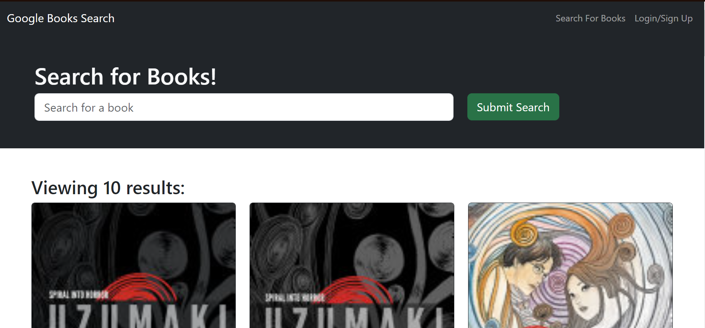

# Book-Search-Engine-C17

## Description

Welcome to Google Books Search! Look up any book you want and receive a variety of results with the books image, author, and detailed description!

## Table of Contents
- [Usage](#usage)
- [Installation](#installation)
- [Credits & Contributions](#contributions)
- [Tests](#tests)
- [Questions](#questions)
- [License](#license)

## Usage

Use this website to search up any book you want.

## Installation

Node, MongoDB, Heroku

## Credits & Contributions

Faith Fechser

## Tests

n/a

## Questions

For any questions, feel free to contact me:

GitHub: [faithfechser](https://github.com/faithfechser)

Email: faithfechser@gmail.com

## License

This application is covered under the MIT license.